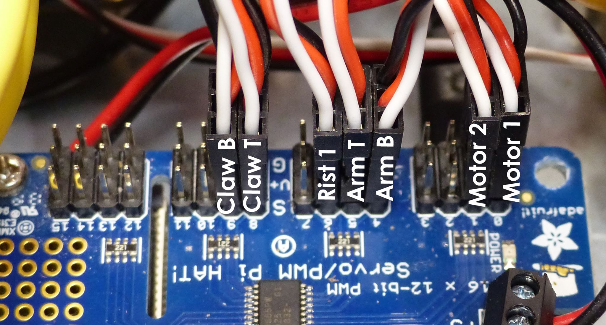

# librarybot

The Library Bot is a telepresence robot for the Port Adelaide Enfield
Libray.

This code is partitially based on code created for the Junkbot, which
was a earlier version of a telepresence robot.

## Videos

Telepresence Library Robot Test 1 - https://www.youtube.com/watch?v=qw003b2TruY

Test 1 Robot griper Arm https://www.youtube.com/watch?v=FKdnzXIyMgM

## Installation

Clone this repository from Github

  git clone https://github.com/PaulSchulz/librarybot.git

## Development
See the file 'notes.org' for for development notes.

## Hardware

PWM Channels 